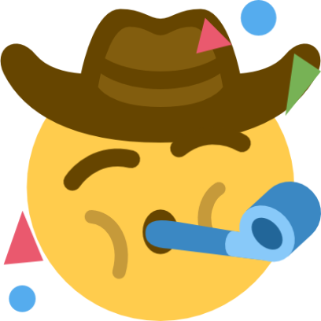

# 👋 Hi, I'm Looksaw

  
  
  

## 🚀 About me

- 🎓 Student and builder from **Xi'an, China**
- 🤖 Interested in **AI agents, LLM applications, GraphRAG and developer tools**
- 🕸️ Working with **HugeGraph** and graph-powered applications
- 🧪 I enjoy turning ideas into small, useful, open-source experiments
- 📮 Questions or collaboration? [Send me an email](mailto:xdu2814031084@gmail.com)

## 🧰 Toolbox

  

  
  
  
  
  
  

## 🌟 Featured projects

## 📊 GitHub activity

## 🏆 More than code

### 💡 Keep building. Keep learning. Keep sharing.

